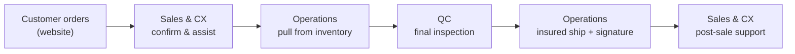
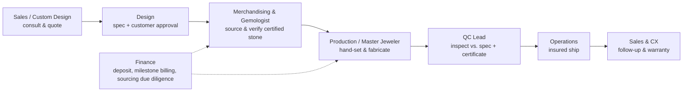
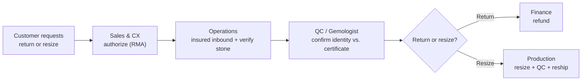
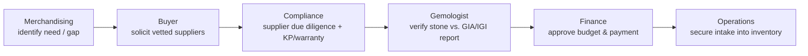

# Organizational Structure

> How Palencia Diamonds is organized — the departments, who reports to whom, what each team owns, and how work flows across teams to turn a certified stone into a delivered piece.

| | |
|---|---|
| **Owner** | Office of the Founder / CEO |
| **Last reviewed** | 2026-07-16 |
| **Review cadence** | Annually |
| **Status** | Active |

---

## 1. Purpose & scope

This document is the map of the company. It answers three questions:

1. **What are the departments** and what is each one accountable for?
2. **Who reports to whom** (reporting lines)?
3. **How does work cross department boundaries** — especially the flows that make or break a customer's moment (a catalog order, a return, a custom commission)?

For the detailed charter of each individual role (mission, responsibilities, KPIs, RACI), see [Roles & Responsibilities](roles-and-responsibilities.md). For how decisions move through this structure, see [Decision-Making](decision-making.md).

We are an established, online-first company (10+ team members) organized into seven functional departments. We are deliberately lean: people wear more than one hat, and the org chart below shows **roles**, not headcount. Where a role is currently filled by a named person, that name is tracked as a `TODO`.

---

## 2. Organizational principles

How we think about structure, so the chart makes sense:

- **Customer trust is the org's product.** Every box on the chart exists to protect the promise: *certified diamonds, handcrafted jewelry, honest prices.*
- **Small, cross-functional, and accountable.** One clear owner per outcome. We avoid committees where a single accountable role will do.
- **Separation of duties where money and stones meet.** The people who buy stones, the people who value them, and the people who pay for them are not the same people. This is a control, not a lack of trust. See [Code of Conduct](code-of-conduct.md) and [Finance & Compliance](#39-finance--compliance).
- **Compliance is everyone's job, owned by one function.** Responsible sourcing and AML/KYC obligations touch Merchandising, Operations, and Finance — but Finance & Compliance owns the program.
- **Flat by default.** Fewer layers, faster decisions, closer to the customer.

---

## 3. Departments at a glance

| # | Department | Owns (one-line mandate) | Led by |
|---|---|---|---|
| 3.3 | **Merchandising & Sourcing** | What we sell and where the stones come from | Head of Merchandising / Buyer |
| 3.4 | **Production & Quality Control** | Turning stones + mounts into finished, inspected pieces | Master Jeweler + QC Lead |
| 3.5 | **Sales & Customer Experience** | Guiding customers and supporting them for life | Head of Sales & CX |
| 3.6 | **Marketing & Brand** | Awareness, demand, and the Palencia story | Head of Marketing |
| 3.7 | **Operations & Fulfillment** | Inventory, insured shipping, logistics, systems | Operations / Fulfillment Manager |
| 3.8 | **Finance & Compliance** | Money, controls, pricing, AML/KYC, responsible sourcing | Finance & Compliance Officer |
| 3.9 | **People & Culture** | Hiring, developing, and caring for the team | People / HR Lead |

All seven leads report to the **CEO / Founder**.

---

## 4. Org chart

```mermaid
graph TD
    CEO["CEO / Founder<br/>TODO: name"]

    CEO --> MERCH["Head of Merchandising / Buyer<br/>TODO: name"]
    CEO --> PROD["Master Jeweler<br/>(Head of Production)<br/>TODO: name"]
    CEO --> SALES["Head of Sales & CX<br/>TODO: name"]
    CEO --> MKT["Head of Marketing<br/>TODO: name"]
    CEO --> OPS["Operations / Fulfillment Manager<br/>TODO: name"]
    CEO --> FIN["Finance & Compliance Officer<br/>TODO: name"]
    CEO --> HR["People / HR Lead<br/>TODO: name"]

    MERCH --> GEM["Gemologist"]
    MERCH --> BUYASST["Merchandising Assistant"]

    PROD --> SETTER["Setter(s) / Bench Jeweler(s)"]
    PROD --> QC["QC Lead"]

    SALES --> CX["Customer Experience Specialist(s)"]
    SALES --> DESIGN["Custom Design Consultant"]

    MKT --> CONTENT["Content & Social"]
    MKT --> PERF["Performance / Web"]

    OPS --> FULFILL["Fulfillment & Shipping Associate(s)"]
    OPS --> INV["Inventory Controller"]

    FIN --> BOOK["Bookkeeping / AP-AR"]
    FIN --> COMPLIANCE["Compliance (AML/KYC, sourcing)"]

    classDef exec fill:#1f2937,stroke:#111827,color:#ffffff;
    classDef dept fill:#f3f4f6,stroke:#9ca3af,color:#111827;
    class CEO exec;
    class MERCH,PROD,SALES,MKT,OPS,FIN,HR dept;
```

> `TODO:` Replace each `TODO: name` with the current role holder. Some roles above (e.g., Gemologist, QC Lead) may be held by the same person in a lean org — note dual-hatting where it applies. See the note on dual-hatting in [§7](#7-a-lean-org-dual-hatting--separation-of-duties).

---

## 5. Reporting lines

| Role | Reports to | Also coordinates closely with |
|---|---|---|
| CEO / Founder | Owners / Board `TODO: [governance body, if any]` | All departments |
| Head of Merchandising / Buyer | CEO | Finance (budget, payment), QC (intake), Gemologist |
| Gemologist | Head of Merchandising | QC Lead, Custom Design |
| Master Jeweler (Head of Production) | CEO | Merchandising, Sales (custom), Operations |
| QC Lead | Master Jeweler | Gemologist, Fulfillment |
| Head of Sales & CX | CEO | Marketing, Production (custom), Operations |
| Customer Experience Specialist | Head of Sales & CX | Fulfillment, Finance (refunds) |
| Head of Marketing | CEO | Sales, Merchandising (catalog) |
| Operations / Fulfillment Manager | CEO | Finance (insurance, reconciliation), Sales, QC |
| Finance & Compliance Officer | CEO | Every department (controls & sourcing) |
| People / HR Lead | CEO | All department leads |

**Dotted-line relationships** (influence without direct authority):

- **Finance & Compliance → every department**, for financial controls, AML/KYC, and responsible-sourcing due diligence. Compliance can pause any transaction that fails due diligence.
- **QC Lead → any function shipping product**, with authority to hold a piece. Per our values, *no piece ships without passing QC — no exceptions for deadlines.* See [Quality Control](../03-operations/quality-control.md).

---

## 6. Department mandates

### 6.3 Merchandising & Sourcing

**Mandate:** Decide what we sell and secure the stones and materials to sell it — profitably and responsibly.

- Build and curate the collection (assortment, price points, trends).
- Source GIA/IGI-certified center stones and materials from vetted suppliers.
- Own supplier relationships and supplier due diligence (with Compliance).
- Manage buying budgets and stone-level margin targets (with Finance).

**Key interfaces:** Gemologist (valuation), Finance (budget/payment), QC (intake inspection), Marketing (what to promote), Custom Design (special-order stones).

### 6.4 Production & Quality Control

**Mandate:** Turn certified stones and mounts into finished, flawless, hand-set pieces — and inspect every one before it ships.

- Hand-set stones; fabricate, size, and finish pieces.
- Execute custom commissions from approved designs.
- Run final QC against spec: stone identity vs. certificate, carat weight, setting security, metal/hallmark, finish.
- Maintain the QC hold authority — the hard stop before fulfillment.

**Key interfaces:** Merchandising (incoming stones), Sales/Custom Design (specs & approvals), Operations (handoff to ship), Gemologist (stone verification).

### 6.5 Sales & Customer Experience

**Mandate:** Guide customers to the right piece with zero pressure, and support them for life.

- Pre-sale guidance (education on the 4Cs, fit, budget, timelines).
- Custom-design consultation and quoting.
- Post-sale support: order status, resizing, warranty, returns.
- Own customer satisfaction and repeat/referral rate — our north-star trust metric.

**Key interfaces:** Marketing (leads), Production (custom & resizing), Operations (fulfillment status), Finance (refunds).

### 6.6 Marketing & Brand

**Mandate:** Grow trusted demand and tell the Palencia story honestly.

- Brand, content, social, email, and paid acquisition.
- Website merchandising and conversion (with Operations/systems).
- Reviews and reputation management.
- Guardrail: marketing claims must be true and substantiated — no overselling grades. See [Code of Conduct](code-of-conduct.md).

**Key interfaces:** Sales (handoff of leads), Merchandising (what's in stock / newness), Compliance (claims review).

### 6.7 Operations & Fulfillment

**Mandate:** Move inventory and orders accurately, securely, and on time — from intake to insured delivery.

- Inventory control and high-value stock security.
- Insured shipping with signature confirmation.
- Order management systems, tooling, and vendor logistics.
- Returns logistics and reconciliation of physical stock.

**Key interfaces:** QC (handoff), Finance (insurance, stock reconciliation), Sales (status), Merchandising (receiving).

### 6.8 Finance & Compliance

**Mandate:** Protect the company's money and license to operate.

- Bookkeeping, AP/AR, cash, and financial controls.
- Pricing governance (honest, defensible pricing). See [Pricing Strategy](../08-finance/pricing-strategy.md).
- AML/KYC program for a dealer in precious stones and jewels (FinCEN obligations).
- Responsible-sourcing program: Kimberley Process, supplier due diligence, OECD guidance, RJC alignment. See [Responsible Sourcing](../05-compliance-ethics/responsible-sourcing.md).

**Key interfaces:** Every department. Holds veto power over transactions failing controls or due diligence.

### 6.9 People & Culture

**Mandate:** Hire for values, develop people, and keep the team well.

- Recruiting, onboarding, and offboarding. See [Hiring & Onboarding](../07-people-hr/hiring-and-onboarding.md).
- Performance, compensation, and development. See [Performance Management](../07-people-hr/performance-management.md).
- Policy, wellbeing, and culture stewardship.

**Key interfaces:** All department leads.

---

## 7. A lean org: dual-hatting & separation of duties

In a 10+ person company, one person often holds more than one role. That is fine — **except** where separating duties is a control we cannot compromise:

| Rule | Why |
|---|---|
| The person who **buys** a stone should not be the sole person who **values** it for pricing. | Prevents inflated valuations / self-dealing. |
| The person who **approves a refund** should not be the sole person who **issues the payment**. | Prevents fraudulent refunds. |
| **QC sign-off** must be independent of the setter who did the work wherever staffing allows. | Independent inspection catches defects. |
| **Inventory counts** are reconciled by someone other than the sole custodian of the stock. | Prevents and detects shrinkage. |

Where headcount forces one person to hold two of these roles, a **compensating control** (a second review, a manager sign-off, an audit trail) must be documented. Owner: Finance & Compliance. See [Code of Conduct](code-of-conduct.md).

---

## 8. How cross-functional work flows

Most value at Palencia is created *across* boxes, not inside them. Below are the four flows that matter most.

### 8.4 Catalog order (in-stock piece)

Owner of the end-to-end outcome: **Head of Sales & CX**. Hard gate: **QC** (D).

### 8.5 Custom commission (the flagship cross-functional flow)

A custom ring touches nearly every department. This is where clean handoffs matter most.

| Stage | Accountable | Key exit criterion before handoff |
|---|---|---|
| Consult & quote | Custom Design Consultant | Written spec + price agreed; deposit terms set |
| Design & approval | Custom Design + Master Jeweler | Customer signs off on CAD/spec |
| Source & verify | Buyer + Gemologist | Stone matches spec; GIA/IGI report verified; due diligence cleared |
| Production | Master Jeweler / Setter | Piece built to spec |
| QC | QC Lead | Stone identity vs. certificate, carat, setting security, hallmark all pass |
| Fulfillment | Operations | Insured, signature-confirmed shipment |
| Post-sale | Sales & CX | Customer confirmed happy; warranty on file |

See the full RACI in [Roles & Responsibilities](roles-and-responsibilities.md#raci-matrix).

### 8.6 Return / resize

Critical control: on **any** inbound stone, QC/Gemologist re-verifies the stone against its original certificate **before** a refund is issued or the piece re-enters inventory. Owner: QC Lead + Finance.

### 8.7 Sourcing a stone

Separation of duties (buy vs. value vs. pay) is enforced across B, D, and E. See [§7](#7-a-lean-org-dual-hatting--separation-of-duties).

---

## 9. Governance & change control

- This structure is owned by the **CEO / Founder**. Material changes (new department, new leadership role, changed reporting line) are CEO decisions, recorded per [Decision-Making](decision-making.md).
- Reviewed at least annually, and whenever the company crosses a growth threshold that strains the current design.
- Day-to-day authority thresholds (who can approve what) live in [Decision-Making](decision-making.md), not here.

---

## Related documents
- [Roles & Responsibilities](roles-and-responsibilities.md)
- [Decision-Making](decision-making.md)
- [Code of Conduct](code-of-conduct.md)
- [Company Overview](../00-company/company-overview.md)
- [Mission, Vision & Values](../00-company/mission-vision-values.md)
- [Quality Control](../03-operations/quality-control.md)
- [Responsible Sourcing](../05-compliance-ethics/responsible-sourcing.md)
- [Pricing Strategy](../08-finance/pricing-strategy.md)
- [Hiring & Onboarding](../07-people-hr/hiring-and-onboarding.md)
- [Documentation Home](../../README.md)
